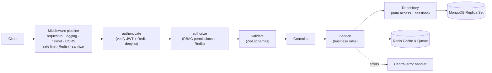
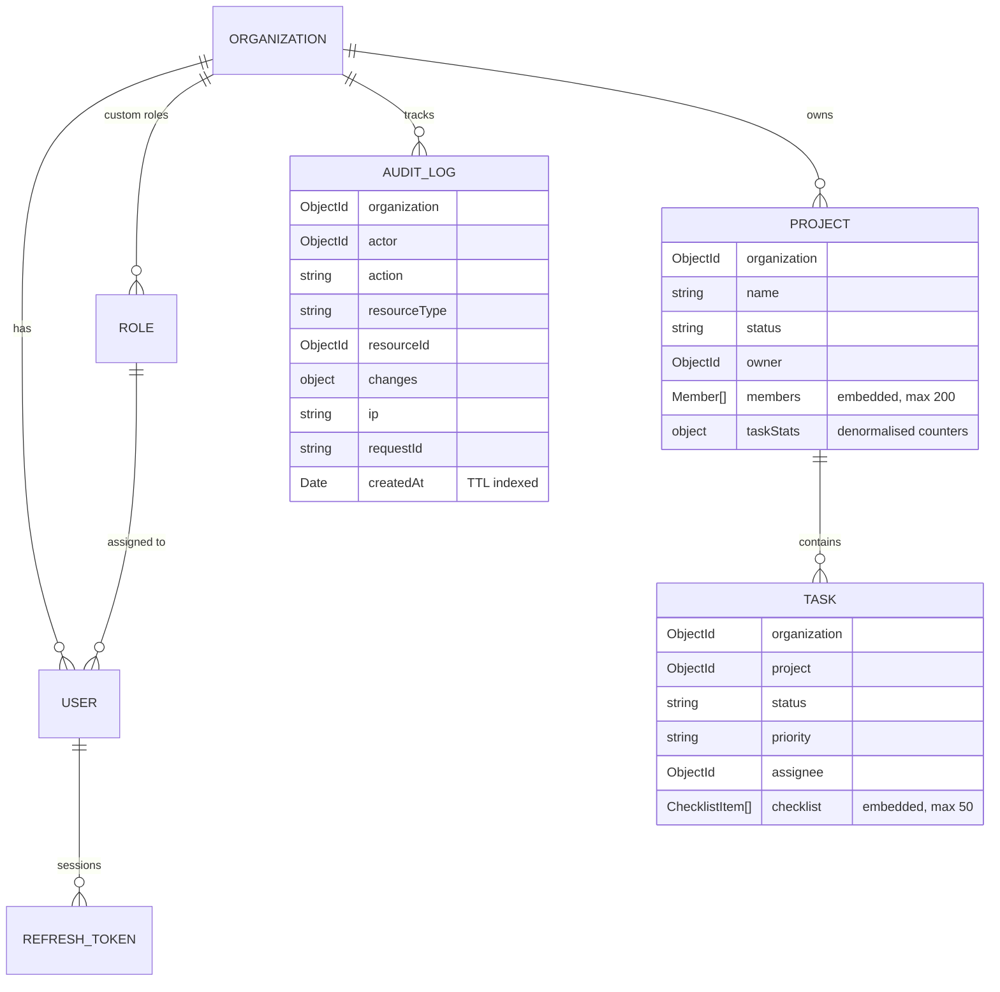

# Nexus RBAC Backend

A modular, production-ready REST API built with **Node.js (Express)**, **MongoDB (Mongoose)**, and **Redis (ioredis & BullMQ)**.
It implements JWT authentication with refresh-token rotation, instant token revocation via Redis denylist, TOTP two-factor authentication, account lockout protection, dynamic Role-Based Access Control, audit logging, a multi-tenant data model with nested documents, and a strict layered architecture.

The domain is a multi-tenant project-management backend: **Organizations → Users / Roles → Projects (with embedded members) → Tasks (with embedded checklists) & Audit Logs**.

---

## Table of contents

1. [Quick start](#quick-start)
2. [Architecture](#architecture)
3. [Project structure](#project-structure)
4. [Authentication & 2FA](#authentication--2fa)
5. [Authorization (RBAC)](#authorization-rbac)
6. [Database design & Replica Set](#database-design--replica-set)
7. [Background jobs & Caching](#background-jobs--caching)
8. [Secrets manager & Config](#secrets-manager--config)
9. [API reference](#api-reference)
10. [Error handling & logging](#error-handling--logging)
11. [Security](#security)
12. [Performance & scalability](#performance--scalability)
13. [Deployment (PM2 & Kubernetes)](#deployment-pm2--kubernetes)
14. [Trade-offs & next steps](#trade-offs--next-steps)

---

## Quick start

The database starts empty. System roles (admin, manager, member, viewer) are created automatically on boot; all other data is created through the API.

### Option A: Docker (recommended)

```bash
cp .env.example .env              # optional for Docker; required for local runs
docker compose up --build -d
curl http://localhost:3000/health/ready
```

### Option B: Local

Requirements: Node.js 20+, MongoDB 6+ replica set, Redis 7+ running locally.

```bash
npm install
cp .env.example .env              # set JWT_ACCESS_SECRET, REDIS_URL, MFA_ENCRYPTION_KEY
npm run dev
```

### Try it

```bash
# a) Register an organization and its first admin user
curl -s -X POST http://localhost:3000/api/v1/auth/register \
  -H 'Content-Type: application/json' \
  -d '{
    "organizationName": "Acme Corp",
    "name": "Admin User",
    "email": "admin@acme.com",
    "password": "N3xus#Secure2026!"
  }'
# Copy the accessToken from the response

# b) Get role ids using the admin token
curl -s http://localhost:3000/api/v1/roles \
  -H "Authorization: Bearer <ADMIN_ACCESS_TOKEN>"
# Note the _id of the "viewer" role

# c) Add a team member with the viewer role
curl -s -X POST http://localhost:3000/api/v1/users \
  -H "Authorization: Bearer <ADMIN_ACCESS_TOKEN>" \
  -H 'Content-Type: application/json' \
  -d '{
    "name": "Viewer User",
    "email": "viewer@acme.com",
    "password": "N3xus#Secure2026!",
    "roleId": "<VIEWER_ROLE_ID>"
  }'

# d) Log in as that viewer and try POST /api/v1/projects; the API returns 403 FORBIDDEN
curl -s -X POST http://localhost:3000/api/v1/auth/login \
  -H 'Content-Type: application/json' \
  -d '{
    "email": "viewer@acme.com",
    "password": "N3xus#Secure2026!"
  }'

# Using the viewer accessToken:
curl -s -X POST http://localhost:3000/api/v1/projects \
  -H "Authorization: Bearer <VIEWER_ACCESS_TOKEN>" \
  -H 'Content-Type: application/json' \
  -d '{"name": "Secret Project"}'
```

---

## Architecture

Every request flows through the same layers. Each layer has one job and only talks to the layer below it.



| Layer | Responsibility | Knows about HTTP? | Knows about Mongoose? |
|---|---|---|---|
| **Routes** | Wire URL + middleware chain to a controller | yes | no |
| **Middlewares** | Cross-cutting concerns: auth, RBAC, validation, errors | yes | no |
| **Controllers** | Read request, call one service, shape response | yes | no |
| **Services** | Business rules, resource-level authorization, orchestration | no | no |
| **Repositories** | All queries; tenant scoping; `.lean()` reads; optional sessions | no | yes |
| **Models** | Schema, validation, indexes | no | yes |

Why this matters: services can be unit-tested without HTTP, repositories can be mocked, and the database could be replaced without rewriting business logic. `createApp()` builds the app without starting a server, so it can be reused by any entry point.

---

## Project structure

```
├── ecosystem.config.js     # PM2 cluster configuration for API and worker
├── .github/
│   └── dependabot.yml      # Dependabot automated dependency updates
src/
├── app.js                  # Express app factory (no side effects)
├── server.js               # Boot: DB/Redis connect, ensure roles, listen, graceful shutdown
├── worker.js               # BullMQ background worker (audit recording, project task cleanup)
├── config/
│   ├── index.js            # Zod-validated env config with Secrets Manager support
│   ├── logger.js           # pino structured logger with redaction
│   ├── db.js               # Mongo connection, pool settings
│   └── redis.js            # Redis client & BullMQ job queue setup
├── constants/
│   ├── permissions.js      # Permission catalogue + system role definitions
│   └── enums.js            # Statuses, priorities, limits
├── models/                 # Mongoose schemas + indexes (User, Org, Project, Task, Role, RefreshToken, AuditLog)
├── repositories/           # Data-access layer (BaseRepository with session support + specialised repos)
├── services/               # Business logic (auth, 2FA, token, role, user, project, task, audit)
├── controllers/            # Thin HTTP adapters
├── routes/                 # Route definitions with auth/RBAC/validation chains
├── middlewares/            # authenticate, authorize, validate, sanitize, rate limit, errors
├── validators/             # Zod request schemas
└── utils/                  # AppError hierarchy, pagination, response helpers
scripts/
└── sync-indexes.js         # Controlled index creation for production deploys
```

---

## Authentication & 2FA

**Two-token model with JTI denylist & TOTP 2FA:**

| | Access token | Refresh token | MFA token |
|---|---|---|---|
| Format | JWT (HS256) with unique `jti` | Opaque random string (384 bits) | Short-lived JWT (HS256, `typ: mfa`) |
| Lifetime | 15 minutes | 7 days | 5 minutes (single use) |
| Stored server-side? | No (stateless, verified against Redis denylist) | Yes, **SHA-256 hash only** | No (stateless, `jti` revoked on verify) |
| Contains | `sub`, `org`, `role`, `jti`, `typ`, `iss`, `aud`, `exp` | nothing | `sub`, `org`, `jti`, `typ`, `iss`, `aud`, `exp` |

- **Stateless access tokens with instantaneous revocation**: Each access token includes a unique `jti` (UUID). Revocations are tracked in Redis:
  - `deny:jti:<jti>` (TTL = remaining access token life) for single-token revocation upon logout.
  - `deny:user:<userId>` = unix timestamp for immediate revocation of all active tokens issued on or before that time (triggered on logout-all, role change, deactivation, or refresh token reuse).
- **Two-Factor Authentication (TOTP)**: Google Authenticator / standard TOTP compatible. Secrets are encrypted with AES-256-GCM at rest using `MFA_ENCRYPTION_KEY`. Includes `lastUsedStep` protection to prevent TOTP replay attacks. Admins with `user:manage` can disable 2FA for users who lost their authenticator device.
- **Account Lockout Policy**: Keyed in Redis by lowercase email (and `mfa:<userId>` for 2FA verification):
  - After 3 consecutive failed attempts (`LOGIN_MAX_ATTEMPTS=3`), the account is locked for 15 seconds (`LOGIN_LOCK_SECONDS=15`).
  - After lock expiry, allows exactly 1 attempt; if that fails, re-locks for 15 seconds.
  - Returns HTTP 429 (`ACCOUNT_LOCKED`) with `details.retryAfterSeconds` and a `Retry-After` header.
  - Checked *before* password verification. Keyed by email even if the account does not exist to prevent user enumeration.
  - Successful login clears the attempt counter. Counter expires after 60 minutes without failures (`LOGIN_ATTEMPT_RESET_MINUTES=60`).
- **NIST / OWASP Password Policy**: 8 to 72 characters (bcrypt byte length verified), at least 1 uppercase, 1 lowercase, 1 digit, and 1 special character. Rejects passwords containing the user's name or email handle, and performs Have I Been Pwned k-anonymity breach checks (`PASSWORD_BREACH_CHECK=true`).

---

## Authorization (RBAC)

Permissions use a `resource:action[:scope]` convention. **Code only ever checks permissions, never role names**, so new roles can be created at runtime without code changes.

### System roles

| Permission | admin | manager | member | viewer |
|---|:-:|:-:|:-:|:-:|
| `org:read` | ✅ | ✅ | ✅ | ✅ |
| `org:manage` | ✅ | | | |
| `user:read` | ✅ | ✅ | ✅ | |
| `user:manage` | ✅ | | | |
| `role:read` | ✅ | ✅ | | |
| `role:manage` | ✅ | | | |
| `project:create` / `update` / `delete` | ✅ | ✅ | | |
| `project:read` | ✅ | ✅ | ✅ | ✅ |
| `task:create` | ✅ | ✅ | ✅ | |
| `task:read` | ✅ | ✅ | ✅ | ✅ |
| `task:update` (own / assigned only) | ✅ | ✅ | ✅ | |
| `task:update:any` | ✅ | ✅ | | |
| `task:delete` | ✅ | ✅ | | |
| `audit:read` | ✅ | | | |

System roles are upserted on every boot (`ensureSystemRoles`), so code and database never drift. Organizations can create **custom roles** via `/api/v1/roles` with any subset of permissions.

### Permission Caching & Tenant Isolation

- **Shared Redis Permission Cache**: Permissions for each role are cached in Redis (`perm:<roleId>`, TTL 300s) and automatically invalidated upon role update or deletion.
- **Tenant Isolation**: Every repository query on business data includes `organization: req.auth.orgId`, taken from the cryptographically signed token. Foreign tenant IDs return **404**, not 403, preventing resource discovery.

---

## Caching & Background Jobs

### Response Caching (Redis)
- `GET /api/v1/projects` lists are cached in Redis for 30 seconds:
  `projects:<orgId>:v<version>:<hash of query params + userId when mine=true>`.
- **Versioned Invalidation**: Increments `projects:<orgId>:version` atomically on project create/update/delete, member add/remove, and task create/delete/status change. Cache invalidation is O(1) without expensive pattern keys scans.

### Background Worker (BullMQ)
- Powered by BullMQ with a shared Redis connection (`maxRetriesPerRequest: null`) using the `nexus-jobs` queue (5 retry attempts with exponential backoff).
- Separate worker process (`src/worker.js`, concurrency 10) executes asynchronous jobs:
  1. `audit.record`: Writes audit log entries to MongoDB asynchronously without blocking HTTP request execution.
  2. `project.cleanup`: Background cleanup worker that deletes all tasks belonging to a deleted project.

---

## Database Design & Replica Set



### MongoDB Replica Set & Multi-Document Transactions

- **Replica Set Configuration**: Local Docker Compose runs MongoDB in a single-node replica set (`rs0`) with automatic initiation healthchecks. Production environments run a 3-member replica set (e.g., MongoDB Atlas or dedicated replica sets) providing automatic master failover and zero-downtime replication.
- **Read Scaling**: Reporting and audit logs use `readPreference: secondaryPreferred` to offload analytical and listing traffic from the primary node.
- **ACID Transactions**: Organization registration (`authService.register`) creates the Organization and initial Administrator User inside a MongoDB transaction (`session.withTransaction`), guaranteeing atomicity with zero orphan records.
- **Audit Logs TTL**: Audit records automatically expire after `AUDIT_RETENTION_DAYS` (default 365 days) via MongoDB background TTL indexes.

---

## Secrets Manager Support

All sensitive configuration parameters support file-based secret injection for enterprise orchestration environments:
- If `JWT_ACCESS_SECRET_FILE`, `MFA_ENCRYPTION_KEY_FILE`, `MONGO_URI_FILE`, or `REDIS_URL_FILE` are defined, the application reads the secret value directly from the specified file path before schema validation.
- Compatible with **Docker Secrets**, **Kubernetes Secrets (Mounted Volumes)**, and **AWS Secrets Manager / Secrets Store CSI Driver**, ensuring credentials never exist in code repositories, environment dumps, or container images.

---

## API Reference

Base path: `/api/v1`. All routes except `/auth/register|login|refresh|logout|2fa/verify` and `/health/*` require `Authorization: Bearer <token>`.

| Method | Path | Permission | Notes |
|---|---|---|---|
| POST | `/auth/register` | public | Creates organization + admin in transaction |
| POST | `/auth/login` | public | Returns tokens or `{ mfaRequired, mfaToken }` |
| POST | `/auth/2fa/setup` | authenticated | Returns TOTP secret and `otpauth://` QR URI |
| POST | `/auth/2fa/enable` | authenticated | `{ code }` verifies and enables 2FA |
| POST | `/auth/2fa/disable` | authenticated | `{ password, code }` disables 2FA |
| POST | `/auth/2fa/verify` | public | `{ mfaToken, code }` completes 2FA login |
| POST | `/auth/refresh` | public | Rotates refresh token |
| POST | `/auth/logout` | public / auth | Revokes refresh token & access token `jti` |
| POST | `/auth/logout-all` | authenticated | Revokes all sessions & token denylist |
| GET | `/auth/me` | authenticated | Profile with role permissions & MFA status |
| GET | `/audit-logs` | `audit:read` | Cursor-paginated audit trail with filters |
| GET | `/users` | `user:read` | `?page&limit&roleId&isActive` |
| POST | `/users` | `user:manage` | Add a team member |
| GET | `/users/:id` | `user:read` | |
| PATCH | `/users/:id` | `user:manage` | Name, role, active flag, `mfaEnabled: false` |
| GET | `/roles` | `role:read` | System + custom roles |
| GET | `/roles/permissions` | `role:read` | Permission catalogue |
| POST | `/roles` | `role:manage` | Create custom role |
| PATCH | `/roles/:id` | `role:manage` | System roles are immutable |
| DELETE | `/roles/:id` | `role:manage` | Blocked while assigned to users |
| GET | `/projects` | `project:read` | Cached (30s) `?page&limit&status&search&mine` |
| POST | `/projects` | `project:create` | |
| GET | `/projects/:id` | `project:read` | Includes populated members |
| PATCH | `/projects/:id` | `project:update` | |
| DELETE | `/projects/:id` | `project:delete` | Enqueues background task cleanup |
| POST | `/projects/:id/members` | `project:update` | Embedded member add |
| DELETE | `/projects/:id/members/:userId` | `project:update` | Owner cannot be removed |
| GET | `/projects/:projectId/tasks` | `task:read` | Cursor paging: `?limit&cursor&status&priority&assignee` |
| POST | `/projects/:projectId/tasks` | `task:create` | |
| GET | `/tasks/me` | `task:read` | Tasks assigned to me |
| GET | `/tasks/:id` | `task:read` | |
| PATCH | `/tasks/:id` | `task:update` or `task:update:any` | Ownership enforced for `task:update` |
| DELETE | `/tasks/:id` | `task:delete` | |
| GET | `/health/live` | public | Liveness probe |
| GET | `/health/ready` | public | Readiness probe (MongoDB + Redis status) |

---

## Deployment & Production Scaling

### PM2 Cluster Mode
To run in production on virtual machines with clustering:
```bash
npm run start:cluster
```
Configured via `ecosystem.config.js`:
- `api`: Cluster mode utilizing `max` CPU cores with zero-downtime reloads.
- `worker`: Single instance background queue processor.

### Kubernetes Deployment (Production Architecture)

In Kubernetes environments:
- **API Deployment**: Deployed with multiple replicas mounting secrets from Kubernetes Secrets / Secrets Store CSI Driver.
  - **Liveness Probe**: `GET /health/live` (initialDelay: 10s, period: 10s)
  - **Readiness Probe**: `GET /health/ready` (initialDelay: 5s, period: 5s, verifies MongoDB replica set and Redis health)
- **Worker Deployment**: Separate Deployment with 1 or more replicas running `node src/worker.js` to process BullMQ tasks.
- **Horizontal Pod Autoscaler (HPA)**:
  - Target CPU utilization: **70%**
  - Minimum replicas: **3**
  - Maximum replicas: **20**
- **Graceful Shutdown**: Traps `SIGTERM` / `SIGINT` to allow in-flight HTTP requests and active background worker jobs to complete before termination.

---

## Security & Reliability Summary

| Layer | Threat | Mitigation |
|---|---|---|
| **Authentication** | Password stuffing / Brute force | Redis Account Lockout (3 fails -> 15s lock) + generic timing-safe responses |
| **Authentication** | Compromised credentials | NIST / OWASP password policy + Have I Been Pwned check + TOTP 2FA |
| **Tokens** | Stolen access token / Session hijacking | 15m lifetime + Redis `jti` revocation denylist + token rotation |
| **Authorization** | Cross-tenant data leakage | Strict tenant scoping on all queries; 404 on unowned resource |
| **Data Integrity** | Partial multi-write failure | MongoDB ACID transactions on registration + BullMQ background cleanup |
| **Reliability** | Node crash / Single point of failure | 3-member MongoDB Replica Set + Redis AOF persistence + K8s / PM2 clustering |
| **Auditability** | Untracked modifications | Async BullMQ audit logging for security and tenant events (1-year TTL) |

